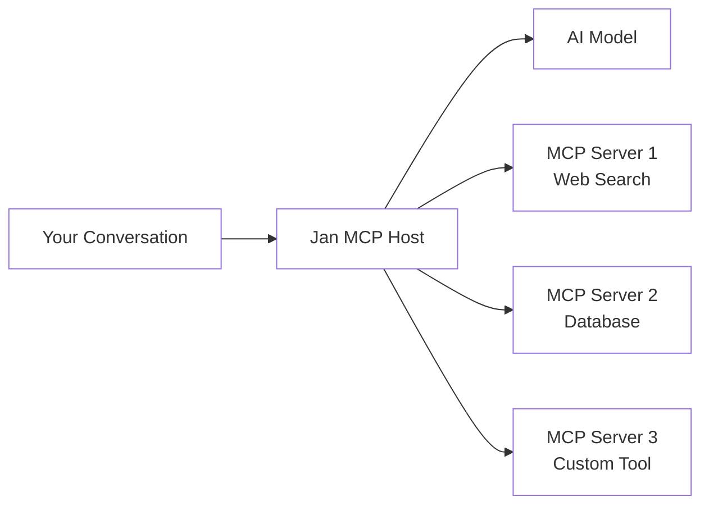

## Overview

The Model Context Protocol (MCP) is an open standard that allows AI models to interact with external tools and data sources. Jan implements MCP as a host, letting you connect your models to databases, APIs, web services, and custom tools through a unified interface.

<Info>
  MCP acts as a universal adapter between AI models and external tools, eliminating the need for custom integrations for each tool-model combination.
</Info>

## Why Use MCP?

<CardGroup cols={2}>
  <Card title="Standardized Integration" icon="plug">
    One protocol for all tools - no custom connectors needed for each model-tool pair.
  </Card>
  <Card title="Extensible Capabilities" icon="puzzle">
    Give models access to real-time data, search engines, databases, and custom APIs.
  </Card>
  <Card title="Modular & Flexible" icon="boxes">
    Swap models or tools without changing your integration code.
  </Card>
  <Card title="Open Ecosystem" icon="globe">
    Use community-built MCP servers or create your own custom tools.
  </Card>
</CardGroup>

## How MCP Works

MCP uses a client-server architecture:



- **Jan (MCP Host)**: Coordinates between your model and MCP servers
- **MCP Servers**: Provide tools, resources, and prompts
- **AI Model**: Decides when and how to use available tools

<Warning>
  Not all models support tool calling. Verify your model is MCP-compatible before setting up integrations. Cloud models like GPT-4 and Claude work well. Local models need tool calling enabled in their capabilities.
</Warning>

## Quick Start

### Prerequisites

<Steps>
  <Step title="Enable Experimental Features">
    1. Go to **Settings > General > Advanced**
    2. Enable **Experimental Features**
    3. Restart Jan if prompted
  </Step>
  
  <Step title="Install Dependencies">
    MCP servers require Node.js or Python:
    
    - [Download Node.js](https://nodejs.org/) (v18 or later)
    - [Download Python](https://www.python.org/) (3.10 or later)
    
    Verify installation:
    ```bash
    node --version  # Should show v18+
    python --version  # Should show 3.10+
    ```
  </Step>
  
  <Step title="Enable MCP Permissions">
    1. Navigate to **Settings > MCP Servers**
    2. Toggle **Allow All MCP Tool Permission** ON
    3. This lets models use MCP tools without prompting each time
  </Step>
</Steps>

### Example: Browser MCP Setup

Let's set up the Browser MCP server to give your models web browsing capabilities:

<Steps>
  <Step title="Add MCP Server">
    1. Go to **Settings > MCP Servers**
    2. Click the **+** button in the upper right
    3. Enter configuration:
       - **Server Name**: `browsermcp`
       - **Command**: `npx`
       - **Arguments**: `@browsermcp/mcp`
       - **Environment Variables**: Leave empty
    4. Click **Save**
  </Step>
  
  <Step title="Install Browser Extension">
    1. Open a Chromium browser (Chrome, Brave, Edge, Vivaldi)
    2. Visit [Browser MCP Extension](https://chromewebstore.google.com/detail/browser-mcp-automate-your/bjfgambnhccakkhmkepdoekmckoijdlc)
    3. Click **Add to Chrome/Browser**
    4. Enable the extension in incognito/private windows
    5. Click the extension icon and connect to the MCP server
  </Step>
  
  <Step title="Enable Model Tool Calling">
    **For Cloud Models (e.g., Claude)**:
    1. Go to **Settings > Model Providers > Anthropic**
    2. After entering your API key, click the **+** or **edit** button next to your model
    3. Enable **Tools**
    
    **For Local Models**:
    1. Go to **Settings > Model Providers > Llama.cpp**
    2. Click the **edit button** next to your model
    3. Enable **Tools** capability
  </Step>
  
  <Step title="Test the Integration">
    1. Create a new chat
    2. Select a model with tools enabled (e.g., Claude Sonnet 4)
    3. Ask: "Visit github.com and tell me what's trending"
    4. Watch the model use the browser tool to complete the task
  </Step>
</Steps>

## Popular MCP Servers

### Search & Research

<CardGroup cols={2}>
  <Card title="Serper" icon="magnifying-glass">
    Google search integration with 2,500 free searches/month
  </Card>
  <Card title="Exa" icon="search">
    AI-powered semantic search engine
  </Card>
  <Card title="Browser MCP" icon="browser">
    Automate web browsing and data extraction
  </Card>
  <Card title="Octagon" icon="graduation-cap">
    Deep research assistant for comprehensive analysis
  </Card>
</CardGroup>

### Productivity

<CardGroup cols={2}>
  <Card title="Todoist" icon="check-square">
    Task management and to-do lists
  </Card>
  <Card title="Linear" icon="list">
    Issue tracking and project management
  </Card>
  <Card title="Canva" icon="palette">
    Design and content creation
  </Card>
</CardGroup>

### Data & Development

<CardGroup cols={2}>
  <Card title="Jupyter" icon="code">
    Execute Python code in Jupyter notebooks
  </Card>
  <Card title="E2B" icon="terminal">
    Secure code execution sandbox
  </Card>
</CardGroup>

## Adding MCP Servers

### Configuration Format

All MCP servers follow this configuration pattern:

| Field | Description | Example |
|-------|-------------|----------|
| **Server Name** | Unique identifier for the server | `serper`, `browsermcp` |
| **Command** | Executable to run the server | `npx`, `python`, `node` |
| **Arguments** | Command arguments | `@serper-mcp/server`, `-m jupyter` |
| **Environment Variables** | Key-value pairs for configuration | `API_KEY=your-key-here` |

### NPM-based Servers

Many MCP servers are distributed via npm:

```
Command: npx
Arguments: @package-name/server
```

**Example - Serper Search**:
```
Server Name: serper
Command: npx
Arguments: @serper-mcp/server
Environment Variables: SERPER_API_KEY=your_api_key
```

### Python-based Servers

Some servers use Python:

```
Command: python
Arguments: -m module_name
```

**Example - Jupyter**:
```
Server Name: jupyter
Command: python
Arguments: -m jupyter_mcp
Environment Variables: (optional)
```

### Local Script Servers

Run custom scripts as MCP servers:

```
Command: node
Arguments: /path/to/your/server.js
```

or

```
Command: python
Arguments: /path/to/your/server.py
```

## Model Compatibility

### Verifying Tool Calling Support

<AccordionGroup>
  <Accordion title="Cloud Models">
    Most cloud models support tool calling:
    
    ✅ **Fully Supported**:
    - OpenAI: GPT-4o, GPT-4 Turbo, GPT-4, GPT-3.5 Turbo
    - Anthropic: Claude Opus 4, Sonnet 4, Haiku 3.5
    - Google: Gemini Pro, Gemini Ultra
    - Mistral: Large, Medium models
    
    ⚠️ **Limited/No Support**:
    - Older GPT-3 models
    - Some specialized models
    
    **Enable Tools**:
    1. Go to **Settings > Model Providers > [Provider]**
    2. Click **edit** or **+** next to your model
    3. Enable **Tools** capability
  </Accordion>
  
  <Accordion title="Local Models">
    Tool calling support varies widely for local models:
    
    ✅ **Good Tool Calling**:
    - Llama 3.3 70B
    - Hermes 2 Pro (Mistral/Llama variants)
    - Jan v1 (optimized for tool calling)
    - Functionary models
    - NousResearch Hermes
    
    ⚠️ **Limited Support**:
    - Smaller models (< 7B parameters)
    - Base models (non-instruct versions)
    - Older model architectures
    
    **Enable Tools**:
    1. Go to **Settings > Model Providers > Llama.cpp**
    2. Click the **edit button** next to your model
    3. Enable **Tools** capability
    4. Test with simple tool calling tasks first
  </Accordion>
</AccordionGroup>

<Tip>
  For best results with MCP tools, use models specifically trained for tool calling like Jan v1, Claude Sonnet 4, or GPT-4o.
</Tip>

## Managing MCP Servers

### View Active Servers

Go to **Settings > MCP Servers** to see:
- Server name and status (connected/disconnected)
- Available tools from each server
- Resource count and types
- Connection logs

### Enable/Disable Servers

Toggle servers on/off without deleting configuration:

1. Find the server in **Settings > MCP Servers**
2. Use the toggle switch to enable/disable
3. Disabled servers won't load or consume resources

### Update Server Configuration

1. Click the **edit icon** next to a server
2. Modify settings (command, arguments, environment variables)
3. Save changes
4. Restart the server for changes to take effect

### Remove Servers

1. Find the server in **Settings > MCP Servers**
2. Click the **delete icon** or **three dots menu**
3. Confirm deletion

## Security Considerations

<Warning>
  MCP gives models access to external tools and data. Review these security guidelines carefully.
</Warning>

### Permission Model

**Allow All MCP Tool Permission**:
- ✅ Convenient - models can use tools automatically
- ⚠️ Less secure - no per-request approval
- **Best for**: Trusted models, local development, single-user setups

**Manual Approval** (coming soon):
- ✅ More secure - approve each tool use
- ⚠️ Less convenient - interrupts workflow
- **Best for**: Sensitive data, production systems, shared computers

### Best Practices

<Steps>
  <Step title="Vet MCP Servers">
    Only install MCP servers from trusted sources. Review code when possible.
  </Step>
  
  <Step title="Use Environment Variables">
    Store API keys in MCP server environment variables, not in prompts or model configs.
  </Step>
  
  <Step title="Limit API Access">
    Use API keys with minimal required permissions. Create read-only keys when possible.
  </Step>
  
  <Step title="Monitor Usage">
    Check server logs regularly for unexpected tool usage or errors.
  </Step>
  
  <Step title="Sandbox Sensitive Data">
    Test MCP servers with non-sensitive data before using with production systems.
  </Step>
</Steps>

### Prompt Injection Risks

MCP servers can be vulnerable to prompt injection:

- Malicious input could trick models into misusing tools
- External data (web pages, documents) may contain adversarial prompts
- Models might perform unintended actions

**Mitigation**:
- Use models less susceptible to prompt injection (GPT-4, Claude)
- Review tool calls in server logs
- Implement rate limiting on sensitive APIs
- Use read-only access when possible

## Building Custom MCP Servers

### MCP Server Basics

An MCP server can provide:

- **Tools**: Functions the model can call (e.g., search, calculate, query database)
- **Resources**: Data the model can access (e.g., files, databases, APIs)
- **Prompts**: Pre-built prompt templates for common tasks

### Quick Example (Node.js)

```javascript
import { Server } from '@modelcontextprotocol/sdk/server/index.js';
import { StdioServerTransport } from '@modelcontextprotocol/sdk/server/stdio.js';

const server = new Server(
  {
    name: 'example-server',
    version: '1.0.0',
  },
  {
    capabilities: {
      tools: {},
    },
  }
);

// Define a tool
server.setRequestHandler('tools/list', async () => {
  return {
    tools: [
      {
        name: 'get_weather',
        description: 'Get current weather for a location',
        inputSchema: {
          type: 'object',
          properties: {
            location: {
              type: 'string',
              description: 'City name',
            },
          },
          required: ['location'],
        },
      },
    ],
  };
});

// Handle tool calls
server.setRequestHandler('tools/call', async (request) => {
  if (request.params.name === 'get_weather') {
    const location = request.params.arguments.location;
    // Your weather API logic here
    return {
      content: [
        {
          type: 'text',
          text: `Weather in ${location}: Sunny, 72°F`,
        },
      ],
    };
  }
});

// Start server
const transport = new StdioServerTransport();
await server.connect(transport);
```

### Resources

- [MCP Official Documentation](https://modelcontextprotocol.io/)
- [MCP GitHub Repository](https://github.com/modelcontextprotocol)
- [MCP Server Examples](https://github.com/modelcontextprotocol/servers)

## Troubleshooting

<AccordionGroup>
  <Accordion title="MCP Server Won't Connect">
    **Symptoms**: Server shows as disconnected in settings
    
    **Solutions**:
    - Verify Node.js or Python is installed correctly
    - Check command and arguments for typos
    - Review server logs in Jan for error messages
    - Ensure required npm packages are accessible: `npx @package-name/server --help`
    - Restart Jan completely
  </Accordion>
  
  <Accordion title="Model Doesn't Use Tools">
    **Symptoms**: Model ignores available MCP tools
    
    **Solutions**:
    - Verify Tools capability is enabled for the model
    - Ensure the model supports tool calling (try Claude or GPT-4)
    - Check that "Allow All MCP Tool Permission" is ON
    - Be explicit in your prompt: "Use the search tool to find..."
    - Try a different model known for good tool calling
  </Accordion>
  
  <Accordion title="Tools Fail to Execute">
    **Symptoms**: Model tries to use tool but gets errors
    
    **Solutions**:
    - Check environment variables (API keys, config)
    - Review server logs for specific error messages
    - Verify API keys have sufficient credits/permissions
    - Test the tool independently (e.g., curl for API-based tools)
    - Ensure network connectivity for cloud-based tools
  </Accordion>
  
  <Accordion title="Vision Models Not Working with MCP">
    **Symptoms**: Browser MCP or screenshot tools fail
    
    **Solutions**:
    - Verify your model supports vision/images (not just tool calling)
    - Enable **Vision** capability in model settings
    - Use models known for vision: GPT-4o, Claude 4, Gemini Pro
    - Check that image data is being passed correctly in server logs
  </Accordion>
  
  <Accordion title="Environment Variables Not Loading">
    **Symptoms**: MCP server can't access API keys or config
    
    **Solutions**:
    - Check format: `KEY=value` (no quotes, no spaces around =)
    - Use multiple lines for multiple variables
    - Restart the MCP server after changing variables
    - Verify variable names match server's requirements
    - Check server documentation for required variables
  </Accordion>
</AccordionGroup>

## Advanced Usage

### Context Management

MCP servers consume context window space:

- Each active tool adds to context overhead
- Large tool responses count toward token limits
- Multiple MCP servers = more context usage

**Optimization Tips**:
- Only enable servers you're actively using
- Use models with larger context windows (32k+) for multiple tools
- Disable tools after completing relevant tasks
- Monitor context usage in conversation

### Chaining Tools

Models can chain multiple MCP tools together:

```
User: "Research the top 3 AI companies and create a summary document"

Model:
1. Uses Serper MCP to search for "top AI companies"
2. Uses Browser MCP to visit company websites
3. Uses File System MCP to create summary document
4. Returns result to user
```

<Tip>
  Use models with strong reasoning capabilities (GPT-4o, Claude Opus) for complex multi-tool workflows.
</Tip>

### Resource Access

Some MCP servers provide resources (not just tools):

- File system access
- Database connections  
- Document repositories
- API endpoints

Models can query these resources directly for context.

## Next Steps

<CardGroup cols={2}>
  <Card title="MCP Examples" icon="books">
    Step-by-step guides for popular MCP servers
  </Card>
  <Card title="Model Parameters" icon="sliders" href="/features/model-parameters">
    Optimize models for better tool calling
  </Card>
  <Card title="Local Models" icon="laptop" href="/features/local-models">
    Find models with strong tool calling support
  </Card>
  <Card title="API Server" icon="server" href="/features/api-server">
    Use MCP-enabled models via API
  </Card>
</CardGroup>